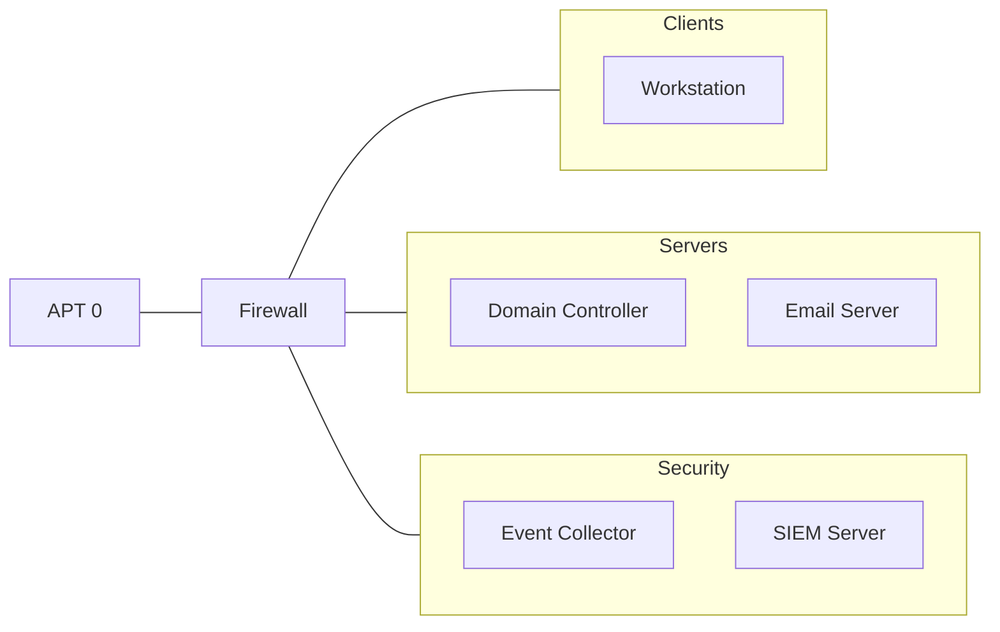

# Death Lab - Wiki
* [Requirements](#requirements)
* [Installation](#installation)
* [User Information](#user-information)
* [Network Information](#network-information)
* [Troubleshooting](#troubleshooting)
* [References](#references)

## Requirements
### Hardware Requirements
* CPU: 16 cores
* Memory: 32 GBs
* Disk Space: 500 GBs 

### Software Requirements
* [Windows 11](https://www.microsoft.com/software-download/windows11)
* [Windows Server 2022](https://info.microsoft.com/ww-landing-windows-server-2022.html)
* [Ubuntu 22.04](https://releases.ubuntu.com/jammy/ubuntu-22.04.4-live-server-amd64.iso)
* [CentOS 7](https://www.centos.org/download/)
* [Packer (1.11.0)](https://developer.hashicorp.com/packer/downloads)
* [Vagrant (2.4.0)](https://developer.hashicorp.com/vagrant/install)
* [Vagrant VMware Utility](https://developer.hashicorp.com/vagrant/install/vmware)
* [Terraform](https://developer.hashicorp.com/terraform/install?)
* [Azure CLI](https://learn.microsoft.com/en-us/cli/azure/install-azure-cli)

**WinRM Parameters**  
You must use "Plaintext" for your WinRM communication transport because the default "Negotiate" will stop working after the Domain Controller is installed.   
* [https://groups.google.com/forum/#!topic/vagrant-up/sZantuCM0q4](https://groups.google.com/forum/#!topic/vagrant-up/sZantuCM0q4)  
* [https://github.com/StefanScherer/adfs2/blob/master/Vagrantfile](https://github.com/StefanScherer/adfs2/blob/master/Vagrantfile)

## Installation
### Azure
**Step 1.** Download the [software required](#software-requirements). 

**Step 2.** Download Death Lab. 
```bash
git clone https://github.com/cyberphor/deathlab
```

**Step 3.** Login to Azure.
```bash
az login
```

**Step 4.** Set your subscription. 
```bash
az account set --subscription "Personal"
```

**Step 5.** Run Terraform. 
```bash
terraform -chdir=terraform init
terraform -chdir=terraform plan
terraform -chdir=terraform apply
```

**Step 6.** Run Terraform again when you want to tear down Death Lab.
```bash
terraform -chdir=terraform destroy
```

### VMWare Workstation
**Step 1.** Change directories to the `packer` folder.
```bash
cd packer
```

**Step 2.** Initialize the packer directory for Packer-use.
```bash
packer init .
```

**Step 3.** Validate your Packer configuration.
```bash
packer validate .
```

You should get output similar to below.
```
The configuration is valid.
```

**Step 4.** Run Packer.
```bash
packer build .
```

**Step 5.** Text goes here.
```bash
cd ../vagrant/
```

**Step 6.** Text goes here.
```bash
vagrant box add velociraptor boxes/velociraptor.box
```

**Step 7.** Text goes here.
```bash
vagrant up
```

## Usage
Text goes here.

## User Information
| Role         | Username          | Password         |
| ------------ | ----------------- | ---------------- |
| Domain Admin | buzz.lightyear.da | 1qaz2wsx!QAZ@WSX | 
| User         | buzz.lightyear    | 1qaz2wsx!QAZ@WSX |

## Network Information
### Network Diagram


### IP Address Scheme
| Virtual Machine   | Hostname | IP Address   | Operating System    | Apps             |
| ----------------- | -------- | ------------ | ------------------- | ---------------- |
| Firewall          | FW01     | 192.168.1.1  | FreeBSD             | pfsense          |
| Workstation       | WK01     | 192.168.1.10 | Windows 11          | Chrome           |
| Domain Controller | DC01     | 192.168.1.20 | Windows Server 2019 | Active Directory |
| Email Server      | MX01     | 192.168.1.21 | Windows Server 2019 | Mail Server      |
| Event Collector   | EC01     | 192.168.1.30 | Windows Server 2019 | Winlogbeat       |
| SIEM Server       | SIEM     | 192.168.1.31 | CentOS 7            | Elastic          |
| Adversary         | APT0     | DHCP Lease   | Kali Linux          | Hacker Tools     |

## Troubleshooting
### Packer
**packer_cache Folder**  
Deleting the `packer_cache` folder between builds is helpful when developing `autounattend.xml` files.
```bash
Remove-Item .\packer_cache -Recurse -Force  
```

### Vagrant
**.vagrant Folder**  
Deleting the `.vagrant` folder between builds is helpful when developing Vagrantfiles.
```bash
Remove-Item .\.vagrant\ -Recurse -Force
```

**Networking**  
The default connection type created is NAT. 

### Miscellaneous
**could not find a supported CD ISO creation command (the supported commands are: xorriso, mkisofs, hdiutil, oscdimg)**  
If you're going to host Death Lab on a Windows machine, [Windows Assessment and Deployment Kit (ADK)](https://go.microsoft.com/fwlink/?linkid=2196127) includes "oscdimg." Make sure to update your execution path after installing the Windows ADK.

## References
* [Windows Answer File Generator](http://www.windowsafg.com)
* [Build a Windows 10 image with Packer using VMware Workstation](https://www.ivobeerens.nl/2022/05/31/build-a-windows-10-image-with-packer-using-vmware-workstation/)
* [ibeeren's Packer Configuration GitHub Repository](https://github.com/ibeerens/Packer)
* [clong's DetectionLab GitHub Repository ](https://github.com/clong/DetectionLab)
* [Unattended Windows Setup Reference](https://learn.microsoft.com/en-us/windows-hardware/customize/desktop/unattend/)
* [Configure BIOS/MBR-Based Hard Drive Partitions by Using Windows Setup](https://learn.microsoft.com/en-us/previous-versions/windows/it-pro/windows-8.1-and-8/hh825701(v=win.10))
* [Installing Oscdimg Using the Windows 11 Assessment and Deployment Kit](https://answers.microsoft.com/en-us/windows/forum/all/downloading-the-oscdimg-utility-for-windows-11/bd0b478d-6df0-4dd9-8cae-3adb469405a0)
* [Packer and WinRM – Mystery Resolved](https://configmgr.nl/index.php/2020/11/01/packer-and-winrm-the-easy-way/)